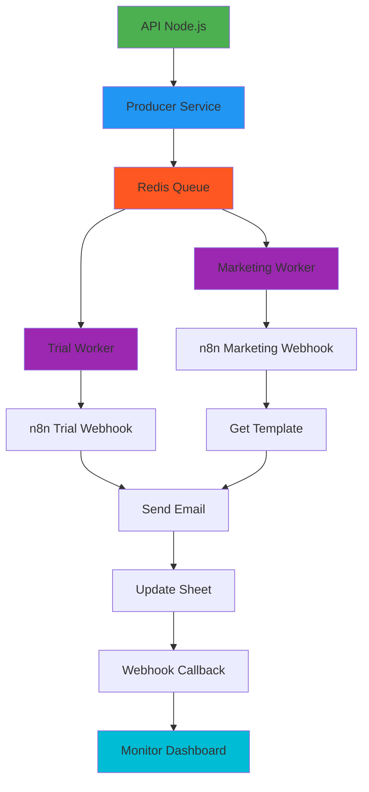

Excelente ideia! Vou criar uma solução completa de **orquestrador próprio** usando Node.js, Redis para filas e Bull para gerenciamento de jobs. É mais flexível e econômico que serviços externos.

## 🏗️ **Arquitetura do Orquestrador Proprietário**



## 📁 **Estrutura do Projeto**

```
email-orchestrator/
├── src/
│   ├── core/
│   │   ├── queue/
│   │   │   ├── producer.service.ts
│   │   │   ├── worker.service.ts
│   │   │   ├── queue.manager.ts
│   │   │   └── queues.ts
│   │   └── cache/
│   │       ├── redis.client.ts
│   │       └── cache.service.ts
│   ├── jobs/
│   │   ├── trial.job.ts
│   │   ├── marketing.job.ts
│   │   ├── bulk.job.ts
│   │   └── webhook.job.ts
│   ├── api/
│   │   ├── controllers/
│   │   │   ├── automation.controller.ts
│   │   │   ├── webhook.controller.ts
│   │   │   └── monitor.controller.ts
│   │   ├── routes/
│   │   │   ├── automation.routes.ts
│   │   │   ├── webhook.routes.ts
│   │   │   └── monitor.routes.ts
│   │   ├── middleware/
│   │   │   ├── auth.ts
│   │   │   ├── validation.ts
│   │   │   └── rate-limit.ts
│   │   └── app.ts
│   ├── services/
│   │   ├── n8n.service.ts
│   │   ├── googleSheets.service.ts
│   │   ├── email.service.ts
│   │   └── webhook.service.ts
│   ├── models/
│   │   ├── job.model.ts
│   │   ├── lead.model.ts
│   │   └── execution.model.ts
│   ├── utils/
│   │   ├── logger.ts
│   │   ├── validator.ts
│   │   └── helpers.ts
│   └── config/
│       ├── queue.config.ts
│       ├── redis.config.ts
│       └── n8n.config.ts
├── docker-compose.yml
├── package.json
├── .env.example
└── README.md
```

## 📦 **Package.json**

```json
{
  "name": "email-orchestrator",
  "version": "1.0.0",
  "description": "Custom orchestrator with Redis queues for email marketing automation",
  "main": "dist/src/api/app.js",
  "scripts": {
    "build": "tsc",
    "start": "node dist/src/api/app.js",
    "start:api": "tsx src/api/app.ts",
    "start:worker": "tsx src/core/queue/worker.service.ts",
    "dev": "concurrently \"npm run start:api\" \"npm run start:worker\"",
    "docker:up": "docker-compose up -d",
    "docker:down": "docker-compose down",
    "test": "jest",
    "lint": "eslint src/**/*.ts",
    "format": "prettier --write src/**/*.ts"
  },
  "dependencies": {
    "express": "^4.18.2",
    "bull": "^4.11.5",
    "bull-board": "^5.0.0",
    "ioredis": "^5.3.2",
    "axios": "^1.6.0",
    "joi": "^17.10.1",
    "dotenv": "^16.3.1",
    "winston": "^3.11.0",
    "mongoose": "^7.5.0",
    "cors": "^2.8.5",
    "helmet": "^7.0.0",
    "express-rate-limit": "^7.1.5",
    "jsonwebtoken": "^9.0.2",
    "bcryptjs": "^2.4.3",
    "googleapis": "^126.0.0",
    "socket.io": "^4.7.2",
    "express-session": "^1.17.3",
    "connect-redis": "^7.1.0",
    "compression": "^1.7.4",
    "express-async-errors": "^3.1.1"
  },
  "devDependencies": {
    "@types/express": "^4.17.21",
    "@types/node": "^20.10.0",
    "@types/bull": "^3.15.7",
    "@types/ioredis": "^5.0.0",
    "typescript": "^5.3.0",
    "tsx": "^4.7.0",
    "concurrently": "^8.2.2",
    "nodemon": "^3.0.1",
    "jest": "^29.7.0",
    "@types/jest": "^29.5.11",
    "supertest": "^6.3.3",
    "eslint": "^8.55.0",
    "prettier": "^3.1.0"
  }
}
```

## 🔧 **Configuração Central**

### **1. .env.example**
```env
# Server
NODE_ENV=production
PORT=3000
API_BASE_URL=http://localhost:3000

# Redis (Queue)
REDIS_HOST=localhost
REDIS_PORT=6379
REDIS_PASSWORD=
REDIS_DB_QUEUE=0
REDIS_DB_CACHE=1

# MongoDB (Optional)
MONGODB_URI=mongodb://localhost:27017/email_orchestrator

# n8n Configuration
N8N_BASE_URL=http://localhost:5678
N8N_TRIAL_WEBHOOK=/webhook/trial
N8N_MARKETING_WEBHOOK=/webhook/marketing
N8N_API_KEY=your_n8n_api_key

# Google APIs
GOOGLE_SHEETS_CREDENTIALS_PATH=./credentials/google-sheets.json
GOOGLE_DRIVE_FOLDER_ID=your_folder_id

# Security
JWT_SECRET=your_super_secret_jwt_key
API_KEY_SECRET=your_api_key_for_external
SESSION_SECRET=your_session_secret

# Queue Configuration
QUEUE_CONCURRENCY=5
QUEUE_MAX_RETRIES=3
QUEUE_BACKOFF_DELAY=5000
QUEUE_RETENTION_DAYS=30

# Rate Limiting
RATE_LIMIT_WINDOW_MS=900000  # 15 minutes
RATE_LIMIT_MAX_REQUESTS=100

# Email (for notifications)
SMTP_HOST=smtp.gmail.com
SMTP_PORT=587
SMTP_USER=your_email@gmail.com
SMTP_PASS=your_app_password
```

### **2. Configuração do Redis**
```typescript
// src/config/redis.config.ts
export interface RedisConfig {
  host: string;
  port: number;
  password?: string;
  db?: number;
  retryStrategy?: (times: number) => number;
}

export const queueRedisConfig: RedisConfig = {
  host: process.env.REDIS_HOST || 'localhost',
  port: parseInt(process.env.REDIS_PORT || '6379'),
  password: process.env.REDIS_PASSWORD || undefined,
  db: parseInt(process.env.REDIS_DB_QUEUE || '0'),
  retryStrategy: (times: number) => {
    const delay = Math.min(times * 50, 2000);
    return delay;
  }
};

export const cacheRedisConfig: RedisConfig = {
  host: process.env.REDIS_HOST || 'localhost',
  port: parseInt(process.env.REDIS_PORT || '6379'),
  password: process.env.REDIS_PASSWORD || undefined,
  db: parseInt(process.env.REDIS_DB_CACHE || '1'),
};
```

## 🎯 **Sistema de Filas com Bull**

### **3. Gerenciador de Filas**
```typescript
// src/core/queue/queue.manager.ts
import Bull, { Queue, JobOptions } from 'bull';
import { queueRedisConfig } from '../../config/redis.config';
import { logger } from '../../utils/logger';

export enum QueueType {
  TRIAL_EMAIL = 'trial-email',
  MARKETING_CAMPAIGN = 'marketing-campaign',
  BULK_PROCESSING = 'bulk-processing',
  WEBHOOK_CALLBACK = 'webhook-callback',
  NOTIFICATIONS = 'notifications'
}

export interface QueueJob<T = any> {
  id?: string;
  name: string;
  data: T;
  opts?: JobOptions;
  timestamp?: Date;
}

export class QueueManager {
  private static instance: QueueManager;
  private queues: Map<QueueType, Queue> = new Map();
  private isInitialized = false;

  private constructor() {}

  static getInstance(): QueueManager {
    if (!QueueManager.instance) {
      QueueManager.instance = new QueueManager();
    }
    return QueueManager.instance;
  }

  async initialize(): Promise<void> {
    if (this.isInitialized) return;

    try {
      // Create all queues
      for (const queueType of Object.values(QueueType)) {
        const queue = new Bull(queueType, {
          redis: queueRedisConfig,
          defaultJobOptions: {
            attempts: parseInt(process.env.QUEUE_MAX_RETRIES || '3'),
            backoff: {
              type: 'exponential',
              delay: parseInt(process.env.QUEUE_BACKOFF_DELAY || '5000')
            },
            removeOnComplete: true,
            removeOnFail: false,
            timeout: 300000 // 5 minutes
          }
        });

        // Event listeners
        queue.on('active', (job) => {
          logger.info(`Job ${job.id} started in queue ${queueType}`, {
            jobId: job.id,
            queue: queueType,
            data: job.data
          });
        });

        queue.on('completed', (job) => {
          logger.info(`Job ${job.id} completed in queue ${queueType}`, {
            jobId: job.id,
            queue: queueType,
            duration: job.finishedOn ? job.finishedOn - job.processedOn : 0
          });
        });

        queue.on('failed', (job, err) => {
          logger.error(`Job ${job?.id} failed in queue ${queueType}`, {
            jobId: job?.id,
            queue: queueType,
            error: err.message,
            attemptsMade: job?.attemptsMade
          });
        });

        queue.on('stalled', (job) => {
          logger.warn(`Job ${job.id} stalled in queue ${queueType}`, {
            jobId: job.id,
            queue: queueType
          });
        });

        this.queues.set(queueType, queue);
      }

      this.isInitialized = true;
      logger.info('Queue manager initialized successfully');
    } catch (error) {
      logger.error('Failed to initialize queue manager', { error });
      throw error;
    }
  }

  async addJob<T>(queueType: QueueType, jobData: QueueJob<T>): Promise<string> {
    const queue = this.queues.get(queueType);
    if (!queue) {
      throw new Error(`Queue ${queueType} not found`);
    }

    try {
      const job = await queue.add(jobData.name, jobData.data, {
        jobId: jobData.id || undefined,
        ...jobData.opts
      });

      logger.info(`Job added to queue ${queueType}`, {
        jobId: job.id,
        queue: queueType,
        jobName: jobData.name
      });

      return job.id.toString();
    } catch (error) {
      logger.error(`Failed to add job to queue ${queueType}`, {
        queue: queueType,
        error: error.message
      });
      throw error;
    }
  }

  async addBulkJobs<T>(
    queueType: QueueType,
    jobs: Array<QueueJob<T>>
  ): Promise<string[]> {
    const queue = this.queues.get(queueType);
    if (!queue) {
      throw new Error(`Queue ${queueType} not found`);
    }

    try {
      const bullJobs = jobs.map(job => ({
        name: job.name,
        data: job.data,
        opts: {
          jobId: job.id,
          ...job.opts
        }
      }));

      const addedJobs = await queue.addBulk(bullJobs);
      const jobIds = addedJobs.map(job => job.id.toString());

      logger.info(`Bulk jobs added to queue ${queueType}`, {
        queue: queueType,
        count: jobs.length,
        jobIds
      });

      return jobIds;
    } catch (error) {
      logger.error(`Failed to add bulk jobs to queue ${queueType}`, {
        queue: queueType,
        error: error.message
      });
      throw error;
    }
  }

  async getJob(queueType: QueueType, jobId: string): Promise<any> {
    const queue = this.queues.get(queueType);
    if (!queue) return null;

    const job = await queue.getJob(jobId);
    return job;
  }

  async getQueueStatus(queueType: QueueType): Promise<any> {
    const queue = this.queues.get(queueType);
    if (!queue) return null;

    const [waiting, active, completed, failed, delayed] = await Promise.all([
      queue.getWaitingCount(),
      queue.getActiveCount(),
      queue.getCompletedCount(),
      queue.getFailedCount(),
      queue.getDelayedCount()
    ]);

    return {
      queue: queueType,
      waiting,
      active,
      completed,
      failed,
      delayed,
      total: waiting + active + completed + failed + delayed
    };
  }

  async getAllQueuesStatus(): Promise<Record<string, any>> {
    const statuses: Record<string, any> = {};

    for (const [queueType, queue] of this.queues.entries()) {
      statuses[queueType] = await this.getQueueStatus(queueType);
    }

    return statuses;
  }

  async pauseQueue(queueType: QueueType): Promise<void> {
    const queue = this.queues.get(queueType);
    if (queue) {
      await queue.pause();
      logger.info(`Queue ${queueType} paused`);
    }
  }

  async resumeQueue(queueType: QueueType): Promise<void> {
    const queue = this.queues.get(queueType);
    if (queue) {
      await queue.resume();
      logger.info(`Queue ${queueType} resumed`);
    }
  }

  async emptyQueue(queueType: QueueType): Promise<void> {
    const queue = this.queues.get(queueType);
    if (queue) {
      await queue.empty();
      logger.info(`Queue ${queueType} emptied`);
    }
  }

  async closeAll(): Promise<void> {
    for (const [queueType, queue] of this.queues.entries()) {
      await queue.close();
      logger.info(`Queue ${queueType} closed`);
    }
    this.isInitialized = false;
  }
}
```

### **4. Worker Service (Processador de Jobs)**
```typescript
// src/core/queue/worker.service.ts
import { QueueManager, QueueType } from './queue.manager';
import { processTrialEmail } from '../../jobs/trial.job';
import { processMarketingCampaign } from '../../jobs/marketing.job';
import { processBulkEmails } from '../../jobs/bulk.job';
import { processWebhookCallback } from '../../jobs/webhook.job';
import { logger } from '../../utils/logger';

export class WorkerService {
  private queueManager: QueueManager;
  private isRunning = false;

  constructor() {
    this.queueManager = QueueManager.getInstance();
  }

  async start(): Promise<void> {
    if (this.isRunning) {
      logger.warn('Worker service is already running');
      return;
    }

    try {
      await this.queueManager.initialize();
      
      // Start processing for each queue
      const queue = (this.queueManager as any).queues;
      
      // Trial Email Queue
      queue.get(QueueType.TRIAL_EMAIL)?.process(
        parseInt(process.env.QUEUE_CONCURRENCY || '5'),
        processTrialEmail
      );

      // Marketing Campaign Queue
      queue.get(QueueType.MARKETING_CAMPAIGN)?.process(
        parseInt(process.env.QUEUE_CONCURRENCY || '3'),
        processMarketingCampaign
      );

      // Bulk Processing Queue
      queue.get(QueueType.BULK_PROCESSING)?.process(
        parseInt(process.env.QUEUE_CONCURRENCY || '2'),
        processBulkEmails
      );

      // Webhook Callback Queue
      queue.get(QueueType.WEBHOOK_CALLBACK)?.process(
        10, // High concurrency for callbacks
        processWebhookCallback
      );

      this.isRunning = true;
      
      logger.info('Worker service started successfully', {
        concurrency: process.env.QUEUE_CONCURRENCY,
        queues: Object.values(QueueType)
      });

      // Handle graceful shutdown
      process.on('SIGTERM', () => this.stop());
      process.on('SIGINT', () => this.stop());

    } catch (error) {
      logger.error('Failed to start worker service', { error });
      throw error;
    }
  }

  async stop(): Promise<void> {
    if (!this.isRunning) return;

    logger.info('Stopping worker service...');
    
    try {
      await this.queueManager.closeAll();
      this.isRunning = false;
      
      logger.info('Worker service stopped gracefully');
      process.exit(0);
    } catch (error) {
      logger.error('Error stopping worker service', { error });
      process.exit(1);
    }
  }

  async getStatus(): Promise<any> {
    if (!this.isRunning) {
      return { status: 'stopped' };
    }

    try {
      const queuesStatus = await this.queueManager.getAllQueuesStatus();
      
      return {
        status: 'running',
        uptime: process.uptime(),
        memory: process.memoryUsage(),
        queues: queuesStatus
      };
    } catch (error) {
      return {
        status: 'error',
        error: error.message
      };
    }
  }
}
```

## 📝 **Jobs Específicos**

### **5. Job de Trial Email**
```typescript
// src/jobs/trial.job.ts
import { Job } from 'bull';
import { N8nService } from '../services/n8n.service';
import { GoogleSheetsService } from '../services/googleSheets.service';
import { logger } from '../utils/logger';

export interface TrialJobData {
  lead: {
    nome: string;
    email: string;
    telefone?: string;
    cnpj?: string;
    empresa?: string;
    source?: string;
  };
  metadata: {
    requestId: string;
    userId?: string;
    timestamp: string;
  };
}

export async function processTrialEmail(job: Job<TrialJobData>): Promise<any> {
  const startTime = Date.now();
  const { lead, metadata } = job.data;
  
  logger.info('Processing trial email job', {
    jobId: job.id,
    email: lead.email,
    requestId: metadata.requestId
  });

  try {
    // Step 1: Validate lead data
    if (!lead.email || !lead.email.includes('@')) {
      throw new Error(`Invalid email: ${lead.email}`);
    }

    // Step 2: Prepare data for n8n
    const n8nPayload = {
      tipo: 'trial',
      lead: {
        Nome: lead.nome || 'Cliente',
        Email: lead.email,
        Telefone: lead.telefone || '',
        CNPJ: lead.cnpj || '',
        Empresa: lead.empresa || lead.nome || 'N/A',
        Source: lead.source || 'api',
        JobId: job.id,
        RequestId: metadata.requestId
      },
      metadata: {
        jobId: job.id,
        timestamp: new Date().toISOString(),
        queue: 'trial-email'
      }
    };

    // Step 3: Call n8n webhook
    logger.info('Calling n8n trial webhook', { email: lead.email });
    
    const n8nResult = await N8nService.triggerTrialWorkflow(n8nPayload);
    
    if (!n8nResult.success) {
      throw new Error(`n8n workflow failed: ${n8nResult.error}`);
    }

    // Step 4: Store in Google Sheets (optional)
    try {
      await GoogleSheetsService.appendLead(
        process.env.TRIAL_SHEET_ID!,
        'Trial_Leads',
        {
          ...n8nPayload.lead,
          Status: 'pending',
          JobId: job.id,
          DataCadastro: new Date().toISOString()
        }
      );
    } catch (sheetError) {
      logger.warn('Failed to store lead in Google Sheets', {
        error: sheetError.message,
        email: lead.email
      });
      // Don't fail the job if Google Sheets fails
    }

    const duration = Date.now() - startTime;
    
    logger.info('Trial email job completed successfully', {
      jobId: job.id,
      email: lead.email,
      duration,
      executionId: n8nResult.executionId
    });

    return {
      success: true,
      lead: lead.email,
      executionId: n8nResult.executionId,
      duration,
      timestamp: new Date().toISOString()
    };

  } catch (error) {
    const duration = Date.now() - startTime;
    
    logger.error('Trial email job failed', {
      jobId: job.id,
      email: lead.email,
      error: error.message,
      duration,
      attempt: job.attemptsMade + 1
    });

    // Re-throw to trigger retry
    throw error;
  }
}
```

### **6. Job de Marketing Campaign**
```typescript
// src/jobs/marketing.job.ts
import { Job } from 'bull';
import { N8nService } from '../services/n8n.service';
import { GoogleSheetsService } from '../services/googleSheets.service';
import { logger } from '../utils/logger';

export interface MarketingJobData {
  niche: 'clinica' | 'imobiliaria' | 'construtora';
  sheetId: string;
  sheetName: string;
  limit: number;
  filters?: {
    status?: string;
    dateFrom?: string;
    dateTo?: string;
  };
  metadata: {
    campaignId: string;
    userId?: string;
    requestId: string;
  };
}

export async function processMarketingCampaign(job: Job<MarketingJobData>): Promise<any> {
  const startTime = Date.now();
  const { niche, sheetId, sheetName, limit, filters, metadata } = job.data;
  
  logger.info('Processing marketing campaign job', {
    jobId: job.id,
    niche,
    campaignId: metadata.campaignId,
    sheetId
  });

  try {
    // Step 1: Fetch leads from Google Sheets
    const leads = await GoogleSheetsService.getLeads(sheetId, sheetName, limit);
    
    if (!leads || leads.length === 0) {
      logger.warn('No leads found for campaign', { sheetId, niche });
      return {
        success: true,
        message: 'No leads to process',
        processed: 0,
        duration: Date.now() - startTime
      };
    }

    // Step 2: Filter unprocessed leads
    const unprocessedLeads = leads.filter(
      (lead: any) => !lead.Status || lead.Status !== '✅ Email Enviado'
    );

    if (unprocessedLeads.length === 0) {
      logger.info('All leads already processed', { sheetId, niche });
      return {
        success: true,
        message: 'All leads already processed',
        processed: 0,
        duration: Date.now() - startTime
      };
    }

    // Step 3: Process in batches
    const batchSize = 20;
    const results = [];
    let processedCount = 0;
    let failedCount = 0;

    for (let i = 0; i < unprocessedLeads.length; i += batchSize) {
      const batch = unprocessedLeads.slice(i, i + batchSize);
      const batchNumber = Math.floor(i / batchSize) + 1;
      
      logger.info(`Processing batch ${batchNumber}`, {
        batch: batchNumber,
        size: batch.length,
        total: unprocessedLeads.length
      });

      try {
        const batchResult = await N8nService.triggerMarketingWorkflow({
          niche,
          leads: batch,
          metadata: {
            ...metadata,
            batchNumber,
            totalBatches: Math.ceil(unprocessedLeads.length / batchSize)
          }
        });

        if (batchResult.success) {
          processedCount += batch.length;
          results.push({
            batch: batchNumber,
            success: true,
            processed: batch.length,
            executionId: batchResult.executionId
          });
        } else {
          failedCount += batch.length;
          results.push({
            batch: batchNumber,
            success: false,
            error: batchResult.error,
            processed: 0
          });
        }

        // Small delay between batches
        if (i + batchSize < unprocessedLeads.length) {
          await new Promise(resolve => setTimeout(resolve, 1000));
        }

      } catch (batchError) {
        logger.error(`Batch ${batchNumber} failed`, {
          batch: batchNumber,
          error: batchError.message
        });
        failedCount += batch.length;
        results.push({
          batch: batchNumber,
          success: false,
          error: batchError.message,
          processed: 0
        });
      }
    }

    const duration = Date.now() - startTime;
    
    logger.info('Marketing campaign job completed', {
      jobId: job.id,
      niche,
      totalLeads: leads.length,
      unprocessed: unprocessedLeads.length,
      processed: processedCount,
      failed: failedCount,
      duration,
      successRate: ((processedCount / unprocessedLeads.length) * 100).toFixed(2) + '%'
    });

    return {
      success: true,
      summary: {
        niche,
        totalLeads: leads.length,
        unprocessedLeads: unprocessedLeads.length,
        processed: processedCount,
        failed: failedCount,
        batches: results.length,
        successRate: (processedCount / unprocessedLeads.length) * 100
      },
      batchResults: results,
      duration
    };

  } catch (error) {
    const duration = Date.now() - startTime;
    
    logger.error('Marketing campaign job failed', {
      jobId: job.id,
      niche,
      error: error.message,
      duration,
      attempt: job.attemptsMade + 1
    });

    throw error;
  }
}
```

## 🚀 **API REST com Dashboard**

### **7. API Controller Atualizada**
```typescript
// src/api/controllers/automation.controller.ts
import { Request, Response } from 'express';
import { QueueManager, QueueType } from '../../core/queue/queue.manager';
import { logger } from '../../utils/logger';

export class AutomationController {
  private queueManager: QueueManager;

  constructor() {
    this.queueManager = QueueManager.getInstance();
  }

  async sendTrialEmail(req: Request, res: Response) {
    try {
      const { nome, email, telefone, cnpj, empresa, source } = req.body;

      // Validation
      if (!email) {
        return res.status(400).json({
          success: false,
          error: 'Email is required'
        });
      }

      const jobData = {
        lead: {
          nome: nome || '',
          email,
          telefone: telefone || '',
          cnpj: cnpj || '',
          empresa: empresa || nome || '',
          source: source || 'api'
        },
        metadata: {
          requestId: this.generateRequestId(),
          userId: req.user?.id,
          timestamp: new Date().toISOString()
        }
      };

      // Add to queue
      const jobId = await this.queueManager.addJob(QueueType.TRIAL_EMAIL, {
        name: 'send-trial-email',
        data: jobData,
        opts: {
          priority: 1, // High priority for trial emails
          attempts: 3,
          delay: 0
        }
      });

      logger.info('Trial email job queued', { jobId, email });

      res.json({
        success: true,
        message: 'Trial email job queued successfully',
        jobId,
        data: {
          email,
          requestId: jobData.metadata.requestId
        },
        monitor: {
          jobUrl: `/api/queue/jobs/${jobId}`,
          queueStatus: `/api/queue/status/trial-email`
        }
      });

    } catch (error) {
      logger.error('Error queueing trial email', { error });
      res.status(500).json({
        success: false,
        error: 'Failed to queue trial email'
      });
    }
  }

  async triggerCampaign(req: Request, res: Response) {
    try {
      const { niche, sheetId, sheetName, limit, campaignName } = req.body;

      const validNiches = ['clinica', 'imobiliaria', 'construtora'];
      if (!validNiches.includes(niche)) {
        return res.status(400).json({
          success: false,
          error: `Invalid niche. Must be one of: ${validNiches.join(', ')}`
        });
      }

      const jobData = {
        niche,
        sheetId,
        sheetName: sheetName || 'Leads',
        limit: limit || 100,
        filters: req.body.filters || {},
        metadata: {
          campaignId: campaignName || `campaign-${Date.now()}`,
          userId: req.user?.id,
          requestId: this.generateRequestId()
        }
      };

      const jobId = await this.queueManager.addJob(QueueType.MARKETING_CAMPAIGN, {
        name: 'marketing-campaign',
        data: jobData,
        opts: {
          priority: 2,
          attempts: 3,
          timeout: 300000 // 5 minutes
        }
      });

      logger.info('Marketing campaign job queued', { jobId, niche, sheetId });

      res.json({
        success: true,
        message: 'Marketing campaign job queued successfully',
        jobId,
        data: {
          niche,
          sheetId,
          campaignId: jobData.metadata.campaignId
        },
        monitor: {
          jobUrl: `/api/queue/jobs/${jobId}`,
          dashboard: `/dashboard`
        }
      });

    } catch (error) {
      logger.error('Error queueing marketing campaign', { error });
      res.status(500).json({
        success: false,
        error: 'Failed to queue marketing campaign'
      });
    }
  }

  async bulkSend(req: Request, res: Response) {
    try {
      const { niche, leads, templateId } = req.body;

      if (!leads || !Array.isArray(leads) || leads.length === 0) {
        return res.status(400).json({
          success: false,
          error: 'Leads must be a non-empty array'
        });
      }

      // Validate each lead
      const invalidLeads = leads.filter(lead => !lead.email);
      if (invalidLeads.length > 0) {
        return res.status(400).json({
          success: false,
          error: 'Some leads are missing email',
          invalidCount: invalidLeads.length
        });
      }

      // Create jobs in batches
      const batchSize = 50;
      const jobs = [];
      
      for (let i = 0; i < leads.length; i += batchSize) {
        const batch = leads.slice(i, i + batchSize);
        
        jobs.push({
          name: `bulk-send-batch-${Math.floor(i / batchSize) + 1}`,
          data: {
            niche,
            leads: batch,
            templateId,
            metadata: {
              batchNumber: Math.floor(i / batchSize) + 1,
              totalBatches: Math.ceil(leads.length / batchSize),
              requestId: this.generateRequestId(),
              userId: req.user?.id
            }
          },
          opts: {
            priority: 3,
            attempts: 2
          }
        });
      }

      const jobIds = await this.queueManager.addBulkJobs(QueueType.BULK_PROCESSING, jobs);

      logger.info('Bulk send jobs queued', {
        totalLeads: leads.length,
        batches: jobs.length,
        jobIds
      });

      res.json({
        success: true,
        message: `Bulk send queued with ${jobs.length} batches`,
        totalLeads: leads.length,
        batches: jobs.length,
        jobIds,
        monitor: {
          dashboard: `/dashboard`,
          queueStatus: `/api/queue/status/bulk-processing`
        }
      });

    } catch (error) {
      logger.error('Error queueing bulk send', { error });
      res.status(500).json({
        success: false,
        error: 'Failed to queue bulk send'
      });
    }
  }

  async getJobStatus(req: Request, res: Response) {
    try {
      const { jobId, queueType } = req.params;
      
      const queue = this.getQueueFromType(queueType);
      if (!queue) {
        return res.status(400).json({
          success: false,
          error: `Invalid queue type: ${queueType}`
        });
      }

      const job = await this.queueManager.getJob(queue, jobId);
      
      if (!job) {
        return res.status(404).json({
          success: false,
          error: 'Job not found'
        });
      }

      const state = await job.getState();
      const progress = job.progress();
      
      res.json({
        success: true,
        job: {
          id: job.id,
          name: job.name,
          state,
          progress,
          data: job.data,
          opts: job.opts,
          attemptsMade: job.attemptsMade,
          timestamp: job.timestamp,
          processedOn: job.processedOn,
          finishedOn: job.finishedOn,
          failedReason: job.failedReason
        }
      });

    } catch (error) {
      logger.error('Error getting job status', { error });
      res.status(500).json({
        success: false,
        error: 'Failed to get job status'
      });
    }
  }

  async getQueueStatus(req: Request, res: Response) {
    try {
      const { queueType } = req.params;
      
      const queue = this.getQueueFromType(queueType);
      if (!queue) {
        return res.status(400).json({
          success: false,
          error: `Invalid queue type: ${queueType}`
        });
      }

      const status = await this.queueManager.getQueueStatus(queue);
      
      res.json({
        success: true,
        queue: queueType,
        status
      });

    } catch (error) {
      logger.error('Error getting queue status', { error });
      res.status(500).json({
        success: false,
        error: 'Failed to get queue status'
      });
    }
  }

  async getAllQueuesStatus(req: Request, res: Response) {
    try {
      const status = await this.queueManager.getAllQueuesStatus();
      
      res.json({
        success: true,
        status,
        timestamp: new Date().toISOString()
      });

    } catch (error) {
      logger.error('Error getting all queues status', { error });
      res.status(500).json({
        success: false,
        error: 'Failed to get queues status'
      });
    }
  }

  private generateRequestId(): string {
    return `req_${Date.now()}_${Math.random().toString(36).substr(2, 9)}`;
  }

  private getQueueFromType(queueType: string): QueueType | null {
    const queueTypes = Object.values(QueueType);
    return queueTypes.includes(queueType as QueueType) ? queueType as QueueType : null;
  }
}
```

### **8. Dashboard com Bull Board**
```typescript
// src/api/app.ts
import express from 'express';
import cors from 'cors';
import helmet from 'helmet';
import { createBullBoard } from '@bull-board/api';
import { BullAdapter } from '@bull-board/api/bullAdapter';
import { ExpressAdapter } from '@bull-board/express';
import { QueueManager, QueueType } from '../core/queue/queue.manager';
import automationRoutes from './routes/automation.routes';
import monitorRoutes from './routes/monitor.routes';
import { logger } from '../utils/logger';

const app = express();

// Middleware
app.use(helmet());
app.use(cors());
app.use(express.json({ limit: '10mb' }));
app.use(express.urlencoded({ extended: true }));

// Bull Board Dashboard
const serverAdapter = new ExpressAdapter();
serverAdapter.setBasePath('/admin/queues');

const queueManager = QueueManager.getInstance();
queueManager.initialize().then(() => {
  const queues = Array.from((queueManager as any).queues.values());
  const adapters = queues.map(queue => new BullAdapter(queue));
  
  createBullBoard({
    queues: adapters,
    serverAdapter: serverAdapter,
    options: {
      uiConfig: {
        boardTitle: 'Email Orchestrator Dashboard',
        boardLogo: {
          path: 'https://img.icons8.com/color/96/000000/email--v1.png',
          width: 96,
          height: 96
        },
        miscLinks: [
          { text: 'API Docs', url: '/api-docs' },
          { text: 'Metrics', url: '/metrics' },
          { text: 'Health', url: '/health' }
        ]
      }
    }
  });
});

app.use('/admin/queues', serverAdapter.getRouter());

// API Routes
app.use('/api/automation', automationRoutes);
app.use('/api/monitor', monitorRoutes);

// Health check
app.get('/health', (req, res) => {
  res.json({
    status: 'healthy',
    timestamp: new Date().toISOString(),
    uptime: process.uptime(),
    memory: process.memoryUsage(),
    env: process.env.NODE_ENV
  });
});

// Metrics endpoint (for Prometheus)
app.get('/metrics', async (req, res) => {
  try {
    const queueManager = QueueManager.getInstance();
    const queuesStatus = await queueManager.getAllQueuesStatus();
    
    const metrics = Object.entries(queuesStatus).map(([queue, status]) => `
# HELP queue_jobs_total Total jobs in ${queue}
# TYPE queue_jobs_total gauge
queue_jobs_total{queue="${queue}",state="waiting"} ${status.waiting}
queue_jobs_total{queue="${queue}",state="active"} ${status.active}
queue_jobs_total{queue="${queue}",state="completed"} ${status.completed}
queue_jobs_total{queue="${queue}",state="failed"} ${status.failed}
queue_jobs_total{queue="${queue}",state="delayed"} ${status.delayed}
    `).join('\n');
    
    res.set('Content-Type', 'text/plain');
    res.send(metrics.trim());
  } catch (error) {
    res.status(500).send(`# ERROR: ${error.message}`);
  }
});

// API Documentation
app.use('/api-docs', express.static('docs'));

// Error handling
app.use((err: Error, req: express.Request, res: express.Response, next: express.NextFunction) => {
  logger.error('Unhandled error', {
    error: err.message,
    stack: err.stack,
    url: req.url,
    method: req.method
  });
  
  res.status(500).json({
    success: false,
    error: process.env.NODE_ENV === 'production' 
      ? 'Internal server error' 
      : err.message
  });
});

const PORT = process.env.PORT || 3000;

app.listen(PORT, () => {
  logger.info(`🚀 Server running on port ${PORT}`);
  logger.info(`📊 Dashboard: http://localhost:${PORT}/admin/queues`);
  logger.info(`🔌 API: http://localhost:${PORT}/api/automation`);
  logger.info(`🏥 Health: http://localhost:${PORT}/health`);
});
```

## 🐳 **Docker Compose Completo**

```yaml
version: '3.8'

services:
  # API Server
  api:
    build: 
      context: .
      dockerfile: Dockerfile.api
    container_name: email-orchestrator-api
    ports:
      - "3000:3000"
    environment:
      - NODE_ENV=production
      - REDIS_HOST=redis
      - REDIS_PORT=6379
      - N8N_BASE_URL=http://n8n:5678
      - MONGODB_URI=mongodb://mongodb:27017/email_orchestrator
    volumes:
      - ./credentials:/app/credentials
      - ./logs:/app/logs
    depends_on:
      - redis
      - mongodb
      - n8n
    networks:
      - email-network
    restart: unless-stopped

  # Worker Service
  worker:
    build:
      context: .
      dockerfile: Dockerfile.worker
    container_name: email-orchestrator-worker
    environment:
      - NODE_ENV=production
      - REDIS_HOST=redis
      - REDIS_PORT=6379
      - QUEUE_CONCURRENCY=10
      - QUEUE_MAX_RETRIES=3
    volumes:
      - ./logs:/app/logs
    depends_on:
      - redis
      - api
    networks:
      - email-network
    restart: unless-stopped
    command: npm run start:worker

  # Redis for Queues
  redis:
    image: redis:7-alpine
    container_name: email-orchestrator-redis
    ports:
      - "6379:6379"
    command: redis-server --appendonly yes --maxmemory 512mb --maxmemory-policy allkeys-lru
    volumes:
      - redis_data:/data
    networks:
      - email-network
    restart: unless-stopped

  # MongoDB for persistence
  mongodb:
    image: mongo:6
    container_name: email-orchestrator-mongodb
    ports:
      - "27017:27017"
    environment:
      - MONGO_INITDB_ROOT_USERNAME=admin
      - MONGO_INITDB_ROOT_PASSWORD=password123
    volumes:
      - mongodb_data:/data/db
    networks:
      - email-network
    restart: unless-stopped

  # n8n Automation
  n8n:
    image: n8nio/n8n:latest
    container_name: email-orchestrator-n8n
    ports:
      - "5678:5678"
    environment:
      - N8N_BASIC_AUTH_ACTIVE=false
      - N8N_WEBHOOK_URL=https://your-domain.com
      - GENERIC_TIMEZONE=America/Sao_Paulo
    volumes:
      - n8n_data:/home/node/.n8n
      - ./n8n-workflows:/home/node/.n8n/workflows
    networks:
      - email-network
    restart: unless-stopped

  # Redis Commander (UI for Redis)
  redis-commander:
    image: rediscommander/redis-commander:latest
    container_name: redis-commander
    ports:
      - "8081:8081"
    environment:
      - REDIS_HOSTS=local:redis:6379
    depends_on:
      - redis
    networks:
      - email-network
    restart: unless-stopped

  # Mongo Express (UI for MongoDB)
  mongo-express:
    image: mongo-express:latest
    container_name: mongo-express
    ports:
      - "8082:8081"
    environment:
      - ME_CONFIG_MONGODB_SERVER=mongodb
      - ME_CONFIG_MONGODB_ADMINUSERNAME=admin
      - ME_CONFIG_MONGODB_ADMINPASSWORD=password123
      - ME_CONFIG_BASICAUTH_USERNAME=admin
      - ME_CONFIG_BASICAUTH_PASSWORD=admin123
    depends_on:
      - mongodb
    networks:
      - email-network
    restart: unless-stopped

networks:
  email-network:
    driver: bridge

volumes:
  redis_data:
  mongodb_data:
  n8n_data:
```

## 🔄 **Scripts de Deploy**

### **9. Scripts de Inicialização**
```bash
#!/bin/bash
# deploy.sh

echo "🚀 Starting Email Orchestrator Deployment..."

# Check if docker-compose is installed
if ! command -v docker-compose &> /dev/null; then
    echo "❌ Docker Compose not found. Please install it first."
    exit 1
fi

# Create necessary directories
mkdir -p ./credentials ./logs ./n8n-workflows

# Check for .env file
if [ ! -f .env ]; then
    echo "⚠️  .env file not found. Creating from example..."
    cp .env.example .env
    echo "📝 Please edit .env file with your configuration"
    exit 1
fi

# Load environment variables
set -a
source .env
set +a

# Build and start services
echo "🔨 Building Docker images..."
docker-compose build

echo "🚀 Starting services..."
docker-compose up -d

echo "⏳ Waiting for services to be ready..."
sleep 10

# Check if services are running
echo "🔍 Checking service status..."
docker-compose ps

echo "✅ Deployment completed!"
echo ""
echo "📊 Dashboard: http://localhost:3000/admin/queues"
echo "🔌 API: http://localhost:3000/api/automation"
echo "📈 Redis UI: http://localhost:8081"
echo "🗄️  MongoDB UI: http://localhost:8082"
echo "🤖 n8n: http://localhost:5678"
echo ""
echo "📋 Useful commands:"
echo "   docker-compose logs -f api     # View API logs"
echo "   docker-compose logs -f worker  # View worker logs"
echo "   docker-compose down           # Stop all services"
echo "   docker-compose restart api    # Restart API"
```

### **10. Script de Monitoramento**
```bash
#!/bin/bash
# monitor.sh

API_URL="http://localhost:3000"
RED="\033[0;31m"
GREEN="\033[0;32m"
YELLOW="\033[1;33m"
NC="\033[0m"

echo -e "${YELLOW}📊 Email Orchestrator Monitor${NC}"
echo "================================="

# Check API health
echo -e "\n🔍 Checking API Health..."
HEALTH_RESPONSE=$(curl -s -f "${API_URL}/health" || echo "ERROR")
if [[ "$HEALTH_RESPONSE" == *"healthy"* ]]; then
    echo -e "  ${GREEN}✅ API is healthy${NC}"
else
    echo -e "  ${RED}❌ API is unhealthy${NC}"
fi

# Check queues status
echo -e "\n📈 Checking Queues Status..."
QUEUES_RESPONSE=$(curl -s "${API_URL}/api/monitor/queues")
if [[ $? -eq 0 ]]; then
    echo "$QUEUES_RESPONSE" | jq -r '.status | to_entries[] | "  \(.key): \(.value.waiting) waiting, \(.value.active) active, \(.value.completed) completed, \(.value.failed) failed"'
else
    echo -e "  ${RED}❌ Failed to get queue status${NC}"
fi

# Check Redis connection
echo -e "\n🔗 Checking Redis..."
REDIS_PING=$(redis-cli -h localhost -p 6379 ping 2>/dev/null || echo "ERROR")
if [[ "$REDIS_PING" == "PONG" ]]; then
    echo -e "  ${GREEN}✅ Redis is connected${NC}"
    
    # Get Redis info
    REDIS_INFO=$(redis-cli -h localhost -p 6379 info memory 2>/dev/null | grep -E "used_memory_human|maxmemory_human")
    echo "  Memory usage:"
    echo "$REDIS_INFO" | while read line; do
        echo "    $line"
    done
else
    echo -e "  ${RED}❌ Redis is not connected${NC}"
fi

# Check MongoDB connection
echo -e "\n🗄️  Checking MongoDB..."
MONGO_STATUS=$(docker exec email-orchestrator-mongodb mongosh --quiet --eval "db.stats().ok" 2>/dev/null || echo "ERROR")
if [[ "$MONGO_STATUS" == "1" ]]; then
    echo -e "  ${GREEN}✅ MongoDB is connected${NC}"
else
    echo -e "  ${RED}❌ MongoDB is not connected${NC}"
fi

# Check n8n
echo -e "\n🤖 Checking n8n..."
N8N_STATUS=$(curl -s -o /dev/null -w "%{http_code}" "http://localhost:5678/healthz" || echo "ERROR")
if [[ "$N8N_STATUS" == "200" ]]; then
    echo -e "  ${GREEN}✅ n8n is running${NC}"
else
    echo -e "  ${RED}❌ n8n is not responding${NC}"
fi

# Check disk space
echo -e "\n💾 Disk Usage:"
df -h . | tail -1 | awk '{print "  Used: "$3", Free: "$4", Total: "$2}'

echo -e "\n${YELLOW}📋 Quick Access:${NC}"
echo "  Dashboard:   http://localhost:3000/admin/queues"
echo "  API Docs:    http://localhost:3000/api-docs"
echo "  Redis UI:    http://localhost:8081"
echo "  MongoDB UI:  http://localhost:8082"
echo "  n8n:         http://localhost:5678"
```

## 🚀 **Como Executar**

### **Passo a Passo:**

1. **Clone e configure:**
```bash
git clone seu-repositorio
cd email-orchestrator
cp .env.example .env
# Edite .env com suas configurações
```

2. **Instale dependências:**
```bash
npm install
```

3. **Inicie com Docker:**
```bash
chmod +x deploy.sh
./deploy.sh
```

4. **Ou execute localmente:**
```bash
# Terminal 1 - API
npm run start:api

# Terminal 2 - Worker
npm run start:worker
```

## 📊 **Vantagens Dessa Solução**

### **✅ Controle Total**
- Código aberto e modificável
- Sem limites de uso
- Customização completa

### **✅ Custo Efetivo**
- Redis open-source
- Sem custos de SaaS
- Escalável horizontalmente

### **✅ Performance**
- Processamento assíncrono
- Retries inteligentes
- Concurrency control

### **✅ Monitoramento**
- Dashboard Bull Board
- Métricas Prometheus
- Logs detalhados

### **✅ Escalabilidade**
- Multi-workers
- Load balancing
- Cluster Redis

Esta solução oferece **toda a funcionalidade do Trigger.dev** mas com controle total, custo zero em infra própria e máxima flexibilidade! Quer que eu detalhe algum aspecto específico?
