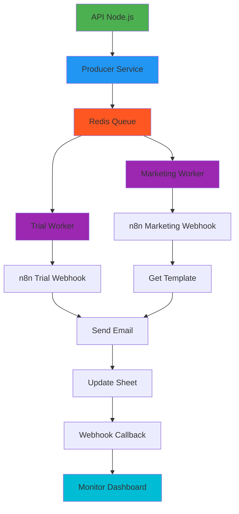

# Email Orchestrator

Custom orchestrator with Redis queues for email marketing automation. Complete system for managing email campaigns with n8n integration, Google Sheets support, and monitoring.

## 🏗️ Architecture



## 📁 Project Structure

```
email-orchestrator/
├── src/
│   ├── core/
│   │   └── queue/
│   │       ├── producer.service.ts
│   │       ├── worker.service.ts
│   │       ├── queue.manager.ts
│   │       └── queues.ts
│   ├── jobs/
│   │   ├── trial.job.ts
│   │   ├── marketing.job.ts
│   │   └── bulk.job.ts
│   ├── api/
│   │   ├── controllers/
│   │   ├── routes/
│   │   └── app.ts
│   ├── services/
│   │   ├── n8n.service.ts
│   │   ├── googleSheets.service.ts
│   │   └── email.service.ts
│   └── config/
│       ├── queue.config.ts
│       └── redis.config.ts
├── docker-compose.yml
├── package.json
└── .env.example
```

## 🚀 Quick Start

### Setup:
```bash
npm install
cp .env.example .env
# Edit .env with your configurations

# Start with Docker
chmod +x deploy.sh
./deploy.sh

# Or run locally (separate terminals)
npm run start:api
npm run start:worker
```

## 📊 Dashboard

- **Dashboard**: http://localhost:3000/admin/queues
- **API**: http://localhost:3000/api/automation
- **Health**: http://localhost:3000/health

## 🔄 API Endpoints

### Trial Email
```bash
POST /api/automation/trial
{
  "nome": "John Doe",
  "email": "john@example.com",
  "telefone": "+1234567890",
  "empresa": "Example Corp"
}
```

### Marketing Campaign
```bash
POST /api/automation/campaign
{
  "niche": "clinica",
  "sheetId": "your-sheet-id",
  "sheetName": "Leads",
  "limit": 100
}
```

## 📈 Monitoring

Check system status with:
```bash
./monitor.sh
```

## 🛠️ Technologies

- **Node.js/Express**: Backend API
- **Bull**: Queue management
- **Redis**: In-memory storage
- **n8n**: Workflow automation
- **Google Sheets API**: Data integration
- **TypeScript**: Type safety
- **Docker**: Containerization

## 🚀 Features

- **Asynchronous processing** with Redis queues
- **Retry mechanisms** with exponential backoff
- **Multiple workflow types** (trial, marketing, bulk)
- **Google Sheets integration**
- **n8n workflow automation**

---

**Complete email automation solution with full control and zero vendor lock-in!**